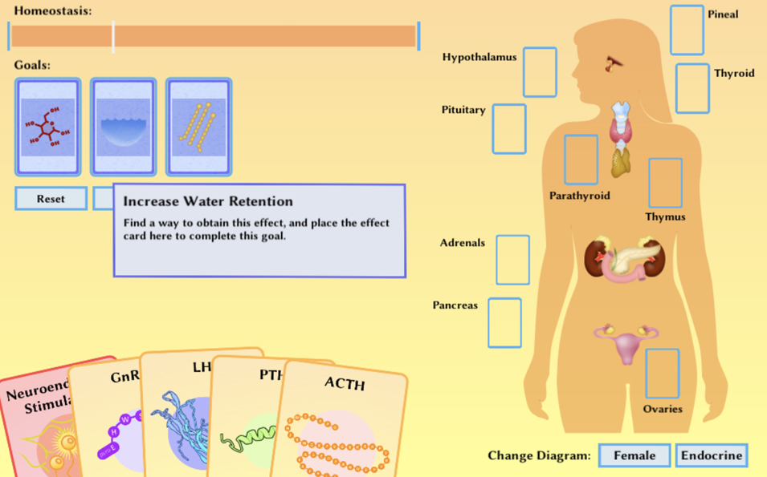

# Pathways: The Endocrine System

Unity project featuring a card-based game for undergraduate physiology students studying the endocrine system. Written in C# and designed for web deployment.

## Background

I began this project in early 2018, when I was teaching an undergraduate Anatomy & Physiology course and wanted to provide a dynamic way for students to practice the complex relationships within the endocrine system. A rudimentary version of the project was completed during that semester, and augmented with improved gameplay before the end of 2018 for the next student cohort.

Project code is currently stored here without the necessary art assets, but a fully functional deployed version is available in my portfolio (see below!). I hope to return to this project someday to update it with modern sprite handling tools and better web integration.

## Usage

For now, this repository is an archive for the legacy code, and is not very portable. Still, it may be interesting to peruse in its current state.

A deployed instance of this app can be found [here](https://binderlab.org/resources/axis_1_2_0). The game is best experienced on a full-fledged web browser; mobile support is currently limited.
